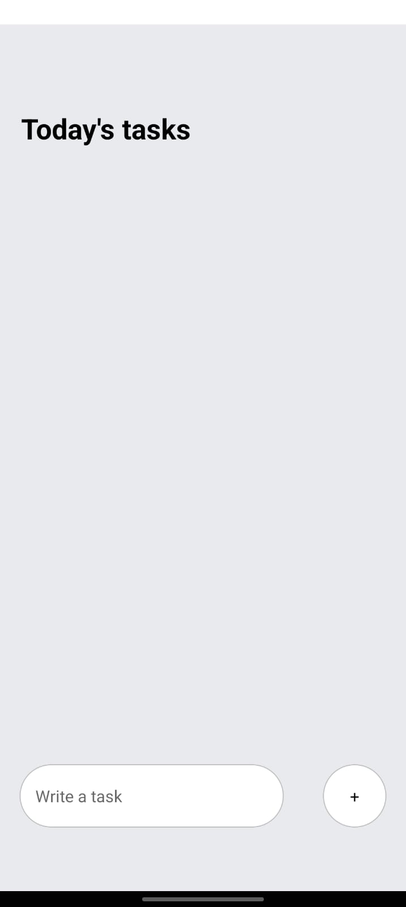
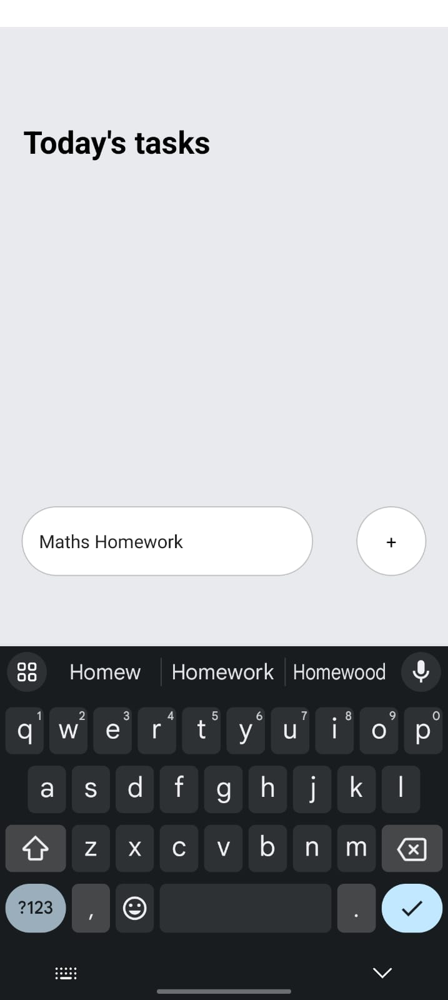
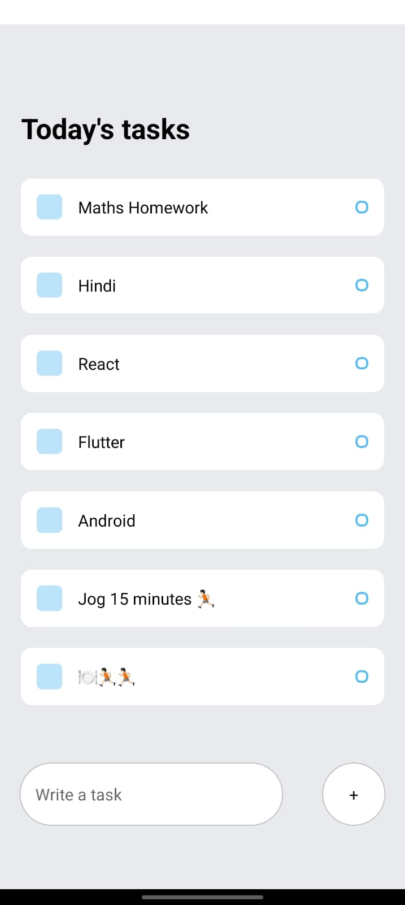
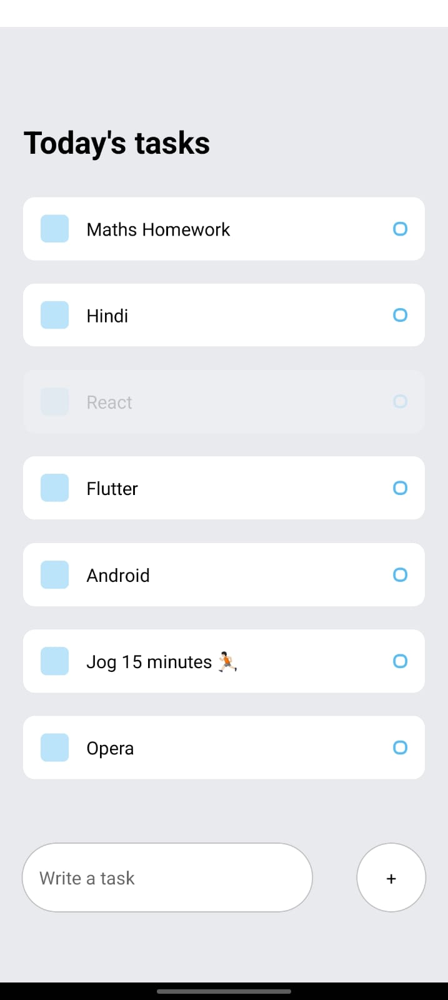
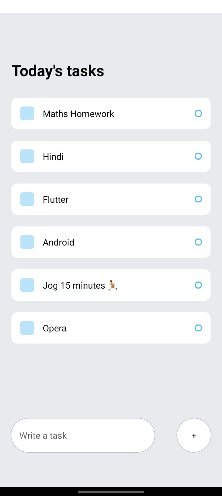

# ToDo List App


## Overview

ToDo List is a simple and intuitive mobile application built with Expo React Native. It allows users to manage their tasks efficiently by adding, marking as completed, and deleting them. The app simplifies task management with a clean interface and easy-to-use functionalities.

## Screenshots

| Home Screen | Adding Task | List of Tasks |
| ------------ | ------------ | -------------- |
|  |  |  |


| Deleting Task (Before) | Deleting Task (After) |
| ------------------------ | ----------------------- |
|  |  |

## Usage

1. Tap on a task to delete it.

## Installation

You can download the APK file for the ToDo List App from the following link: [Download ToDo List App](https://github.com/rohanudhwani/todoList-RN/raw/master/ToDo.apk)

## How to Run

Make sure you have Expo CLI installed.

1. Clone the repository:
   ```bash
   git clone https://github.com/rohanudhwani/todoList-RN.git
   ```

2. Navigate to the project directory:
   ```bash
   cd todoList-RN
   ```

3. Install dependencies:
   ```bash
   npm install
   ```

4. Start the Expo development server:
   ```bash
   expo start
   ```

5. Use Expo Go or scan the QR code to run the app on your mobile device.

## Contribution

Feel free to contribute to the project by submitting issues or pull requests.

## License

This project is licensed under the [MIT License](LICENSE).
